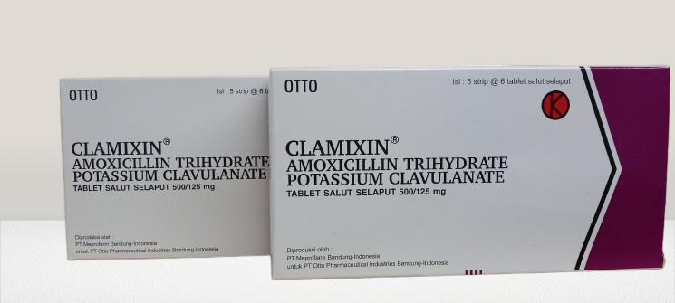

<!DOCTYPE html>
<html lang="id">
<head>
  <meta charset="UTF-8" />
  <meta name="viewport" content="width=device-width, initial-scale=1.0" />
  <title>Betalaktam Penisilin - PT Meprofarm Pharmaceutical Industries</title>
  <link rel="stylesheet" href="style.css" />
</head>
<body>
  <header class="hero">
    <h1 class="fade-in">BETALAKTAM PENISILIN</h1>
    <h2 class="fade-in delay">PT Meprofarm Pharmaceutical Industries</h2>
  </header>

  <section class="intro">
    

      PT Meprofarm merupakan perusahaan farmasi terkemuka di Indonesia yang berkomitmen menghadirkan produk antibiotik berkualitas tinggi, termasuk golongan <b>Betalaktam Penisilin</b> yang berperan penting dalam pengobatan infeksi bakteri.
    

  </section>

  <section class="products">
    <h2 class="section-title">Produk Unggulan</h2>

    

      
      

        <h3>Amoxicillin</h3>
        
Antibiotik spektrum luas yang efektif melawan berbagai infeksi bakteri. Digunakan untuk infeksi saluran pernapasan, telinga, kulit, dan saluran kemih.

      

    

    

      
      

        <h3>Ancla</h3>
        
Produk kombinasi Amoxicillin dan Clavulanate Potassium yang memperkuat efektivitas terhadap bakteri penghasil beta-laktamase.

      

    

    

      
      

        <h3>Clamixin</h3>
        
Antibiotik dengan stabilitas tinggi dan efektivitas optimal terhadap infeksi saluran pernapasan, kulit, dan jaringan lunak.

      

    

  </section>

  <section class="interaction">
    <h2>Bagikan Pendapat Anda</h2>
    <button id="likeBtn"> 0</button>
    

      <textarea id="commentInput" placeholder="Tulis komentar Anda..."></textarea>
      <button id="commentBtn">Kirim</button>
      <ul id="commentList"></ul>
    

  </section>

  <footer>
    
© 2025 Gilang Muhamad Husen | PT Meprofarm Pharmaceutical Industries

    <audio controls autoplay loop>
      <source src="dreams.mp3" type="audio/mpeg" />
    </audio>
  </footer>

  
</body>
</html>
@import url('https://fonts.googleapis.com/css2?family=Playfair+Display:wght@600&family=Poppins:wght@400;500&display=swap');

body {
  margin: 0;
  font-family: 'Poppins', sans-serif;
  background: linear-gradient(135deg, #f9f7f3, #d4af37);
  color: #222;
  overflow-x: hidden;
}

header.hero {
  text-align: center;
  padding: 100px 20px;
  background: url('img/background.jpg') center/cover no-repeat;
  color: white;
  text-shadow: 0 2px 10px rgba(0, 0, 0, 0.5);
}

h1 {
  font-family: 'Playfair Display', serif;
  font-size: 3.5em;
  letter-spacing: 2px;
}

.fade-in {
  opacity: 0;
  transform: translateY(30px);
  animation: fadeInUp 1s ease forwards;
}
.delay {
  animation-delay: 0.5s;
}

@keyframes fadeInUp {
  to {
    opacity: 1;
    transform: translateY(0);
  }
}

.intro {
  text-align: center;
  margin: 50px auto;
  max-width: 800px;
  font-size: 1.1em;
}

.products {
  padding: 50px;
  text-align: center;
}

.section-title {
  font-family: 'Playfair Display', serif;
  font-size: 2em;
  margin-bottom: 40px;
}

.product-card {
  display: flex;
  align-items: center;
  justify-content: center;
  background: rgba(255,255,255,0.9);
  box-shadow: 0 8px 20px rgba(0,0,0,0.1);
  margin: 20px auto;
  border-radius: 20px;
  max-width: 900px;
  transition: transform 0.3s;
}

.product-card:hover {
  transform: scale(1.03);
}

.product-card img {
  width: 250px;
  border-radius: 20px 0 0 20px;
}

.product-info {
  padding: 20px;
  text-align: left;
}

.interaction {
  text-align: center;
  margin: 60px 0;
}

#likeBtn {
  background: gold;
  border: none;
  padding: 10px 20px;
  border-radius: 25px;
  cursor: pointer;
  font-size: 1.2em;
  transition: 0.3s;
}
#likeBtn:hover {
  background: #e0b500;
}

.comment-section {
  margin-top: 20px;
}
textarea {
  width: 60%;
  height: 80px;
  padding: 10px;
  border-radius: 10px;
  border: 1px solid #ccc;
}
button#commentBtn {
  margin-left: 10px;
  padding: 10px 20px;
  border: none;
  background: #2b2b2b;
  color: white;
  border-radius: 10px;
  cursor: pointer;
}
ul#commentList {
  list-style: none;
  padding: 0;
  margin-top: 20px;
  max-width: 600px;
  margin-left: auto;
  margin-right: auto;
  text-align: left;
}
ul#commentList li {
  background: rgba(255,255,255,0.9);
  padding: 10px;
  margin-bottom: 10px;
  border-radius: 10px;
  box-shadow: 0 2px 8px rgba(0,0,0,0.1);
}

footer {
  background: #111;
  color: gold;
  text-align: center;
  padding: 20px;
  font-family: 'Playfair Display', serif;
}
audio {
  margin-top: 10px;
}
